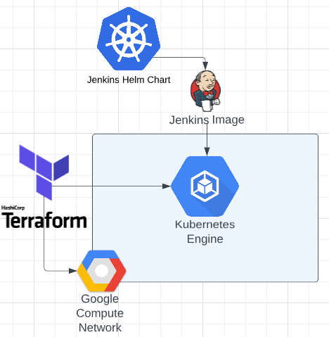

# at-the-helm
## About

*Creator*: Morgan Rogers

*Roles*: Designer, Platform Engineer

## Description

This project will be deploying a **Jenkins** image, which is a CI/CD service, on GKE (Google Kubernetes Engine) using **Helm**. **GKE** will be deployed using **Terraform** which is an infrastructure as code tool.

## Motivation

I (Morgan) currently work as a Platform Engineer and my team is starting to work with Kubernetes more (mainly in AWS) and I want to get more experience with it outside of the work environment. My team is DevOps focused and we have Jenkins running on on-premise services but I want to attempt to get it running on Kubernetes. I am using GCP/GKE because they offer a $300 credit and cloud kubernetes services can get quite expensive if it is kept running for long periods.

Running Jenkins on Kubernetes provides important benefits over a standard VM deployment. Kubernetes engine provides ephemeral build executors which allows each build to run in a clean environment. Since the executors are ephemeral, they are not running when a build is not executing.

## Tools/Technologies

- **Terraform** (for deploying GKE and Google Compute Network)
- **GKE** (Google Kubernetes Engine)
- **Helm** (configuration and installation of Jenkins)
- **Jenkins** (the application being deployed on GKE)

## System Architecture

## More Information on the Tools Used

- **Terraform** is an infrastructure as code tool that allows for the definition cloud resources in human-readable configuration files that can be versioned, reused, and shared.
- **GKE** is Google's hosted version of Kubernetes which is a powerful cluster manager and orchestration system for containers.
- **Helm** is a tool that automates the creation, packaging, configuration, and deployment of Kubernetes applications by combining Kubernetes configuration files into a single package.
- **Jenkins** is an open-source automation server that allows for orchestration of build, test, and deployment pipelines.

[More Documentation Here](/documentation/)

